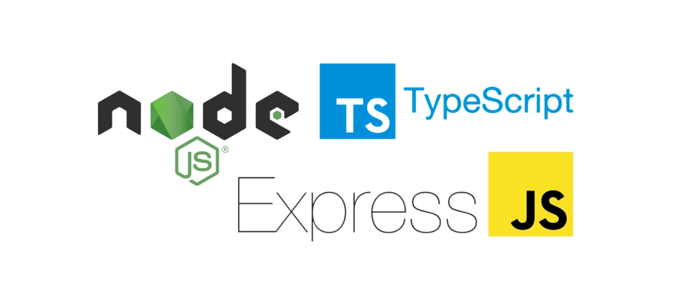

# :card_index_dividers: NodeJS Typescript Project



## :gear: Requerimientos

* node v18

## :tada: Uso

```bash
npm install

npm run start
```

## :tada: Debug con vscode

1. Crear un arhivo **.vscode/launch.json** y agregar lo siguiente

    ```json
    {
        "version": "0.2.0",
        "configurations": [
            {
                "type": "node",
                "request": "launch",
                "name": "Launch Program",
                "program": "${workspaceFolder}/src/index.ts",
                "preLaunchTask": "tsc: build - tsconfig.json",
                "sourceMaps": true,
                "outFiles": [
                    "${workspaceFolder}/dist/**/*.js"
                ],
            }
        ]
    }
    ```

2. Ejecutar el debugger de vscode

---

## :grin: Autor

> **Brian Lobo**

* Github: [brianwolf](https://github.com/brianwolf)
* Docker Hub:  [brianwolf94](https://hub.docker.com/u/brianwolf94)
